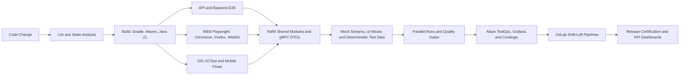

  <h1>Yauheni Papovich</h1>
  <h3>QA Automation Tech Lead | Lead SDET | Quality Engineering Leader</h3>
  

    I build scalable quality engineering platforms for high-load products: test architecture, KMM frameworks,
    shift-left CI/CD, observability, and AI-assisted QA workflows.
  

  

    
    
    
  

  

    
    
    
  

---

## Why teams trust me

- 8+ years in QA Automation / SDET leadership across live streaming, iGaming, and healthcare.
- Platform owner for 12 feature teams across 4 product lines, with up to 6 direct-report SDETs.
- Architected ~5,850+ autotests across WEB Playwright, iOS XCTest, and backend E2E layers.
- Re-platformed WEB regression from Selenium Grid to cross-browser Playwright: ~98%+ stability and 3h to 50min regression time.
- Launched AI agents for QA with RAG, Allure MCP, and custom MCP integrations: ~25% savings on documentation and triage.

## Automation Stack

  
  
  
  
  
  
  
  
  
  
  
  
  
  
  
  
  
  
  
  
  
  
  
  
  
  
  
  

## What I build

| Area | Outcome |
|---|---|
| Test Architecture | Cross-stack KMM framework for WEB, iOS, Backend/Android, and API automation |
| CI/CD Quality Gates | GitLab shift-left flows across 160+ microservices with deploy, autotests, validation, and release certification |
| Reliability Engineering | Mock/stub platforms, deterministic test data, and observability that reduce flaky tests and defect escape |
| AI for QA | RAG agents, Allure MCP, AI failure analysis, and AI-assisted review for faster triage |
| Team Enablement | Automation roadmap, mentoring, standards, hiring, and practical quality leadership |

## Automation Delivery Preview

### What I can configure end-to-end

- Backend, iOS, Android, Web, and API automation framework architecture with shared KMM modules.
- Spring Boot mock/stub services, mock streams, UI component mocks, and third-party dependency virtualization.
- Cross-browser Playwright regression with Moon, BrowserStack, real iOS devices, and parallel execution.
- GitLab CI/CD quality gates with Allure TestOps, Grafana KPI dashboards, Coralogix log analysis, and Slack/Jira notifications.
- AI-assisted QA workflows: RAG documentation, Allure MCP integrations, test-run troubleshooting, and code-review support.
- Pipeline optimization that reduces regression time, speeds up releases, and raises stability for product teams.

### What I own as Tech Lead

- Automation roadmap and platform ownership for multiple feature teams and product lines.
- Estimation, sprint planning, task prioritization, framework strategy, and code review standards.
- Technical interviews, hiring, and mentoring for QA, Manual QA, and SDET engineers.
- Cross-functional quality ownership with Product, Developers, and QA through release readiness.

## GitHub Activity

## Contact

- LinkedIn: [evgeny-popovich](https://www.linkedin.com/in/evgeny-popovich)
- Telegram: [@YauheniPo](https://t.me/YauheniPo)
- Questions / collab: [open an issue](https://github.com/YauheniPo/YauheniPo/issues)
