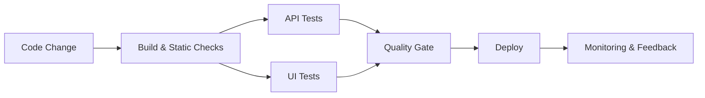

  <h1>Yauheni Popovich</h1>
  <h3>Tech Lead | SDET | Automation Architect</h3>
  

    I build scalable QA ecosystems, CI/CD quality gates, and resilient test automation for fast product delivery.
  

  

    
    
    
  

  

    
    
    
  

---

## Why teams trust me

- I turn flaky, slow test suites into stable delivery pipelines.
- I design maintainable test architecture for UI, API, and integration layers.
- I embed quality into CI/CD so releases stay fast and safe.
- I mentor engineers to scale quality ownership across teams.

## Automation Stack

  
  
  
  
  

  
  
  
  
  
  
  
  
  

## What I build

| Area | Outcome |
|---|---|
| Test Frameworks | Reusable, readable, and scalable automation architecture |
| CI/CD Quality Gates | Fast feedback with confidence on every commit |
| Reliability Engineering | Flaky test reduction and stable release readiness |
| Team Enablement | Mentoring, standards, and practical quality leadership |

## Automation Delivery Preview

## GitHub Activity

  
  

## Contact

- LinkedIn: [e-popovich](https://www.linkedin.com/in/e-popovich)
- Telegram: [@YauheniPo](https://t.me/YauheniPo)
- Questions / collab: [open an issue](https://github.com/YauheniPo/YauheniPo/issues)
