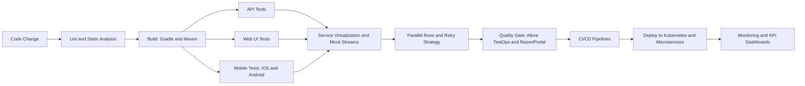

  <h1>Yauheni Papovich</h1>
  <h3>Tech Lead | SDET | Automation Architect</h3>
  

    I build scalable QA ecosystems, CI/CD quality gates, and resilient test automation for fast product delivery.
  

  

    
    
    
  

  

    
    
    
  

---

## Why teams trust me

- I turn flaky, slow test suites into stable delivery pipelines.
- I design maintainable test architecture for UI, API, and integration layers.
- I embed quality into CI/CD so releases stay fast and safe.
- I mentor engineers to scale quality ownership across teams.

## Automation Stack

  
  
  
  
  
  
  
  
  
  
  
  
  
  
  
  
  
  
  
  
  
  
  
  
  
  

## What I build

| Area | Outcome |
|---|---|
| Test Frameworks | Reusable, readable, and scalable automation architecture |
| CI/CD Quality Gates | Fast feedback with confidence on every commit |
| Reliability Engineering | Flaky test reduction and stable release readiness |
| Team Enablement | Mentoring, standards, and practical quality leadership |

## Automation Delivery Preview

### What I can configure end-to-end

- Backend, iOS, and Web automation framework architecture.
- Spring mock services and mock streams to cut flaky tests and reduce environment load by 85%.
- Parallel test execution, retry strategy, and logging improvements for stable runs (up to 98% pass rate).
- CI/CD quality gates with Allure TestOps, ReportPortal, and KPI data collection tooling.
- Mobile test automation ownership for iOS and Android (automation + release testing).
- Pipeline optimization that can reduce average testing time and speed up delivery by about 50% (and about 30% for iOS/Web client delivery).

### What I own as Tech Lead

- Estimation, sprint planning, and task prioritization for automation teams (4 to 6 engineers).
- Framework strategy, architecture decisions, and code review standards.
- Technical interviews and mentoring for QA/SDET engineers.
- Cross-functional quality ownership with Product, Developers, and QA through release readiness.

## GitHub Activity

## Contact

- LinkedIn: [e-popovich](https://www.linkedin.com/in/e-popovich)
- Telegram: [@YauheniPo](https://t.me/YauheniPo)
- Questions / collab: [open an issue](https://github.com/YauheniPo/YauheniPo/issues)
